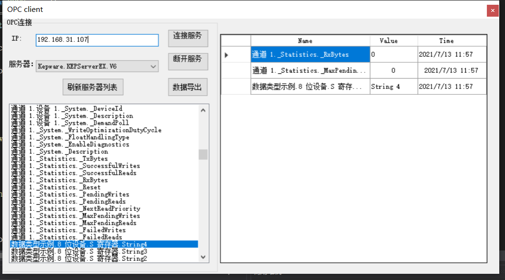
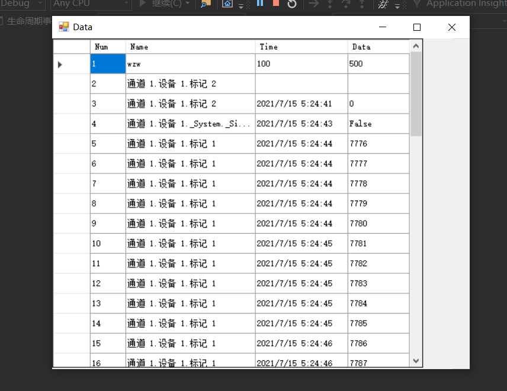

#OPC-DA Client
用于从OPC—Server中读取节点数据

##OPC-DA Client有哪些功能？
 
* 可以实现本地或远程链接OPC-Server
* 可以根据IP地址链接
* 可以展示所有节点
* 可以监视选中的节点
* 能将数据实时写入数据库
* 能将数据节点状态写入日志

##问题反馈
个人项目 若有不足 欢迎指正
 

##项目展示
* 
* 
##关于作者
* warren@伟
* E-mail:warren_wzw@163.com